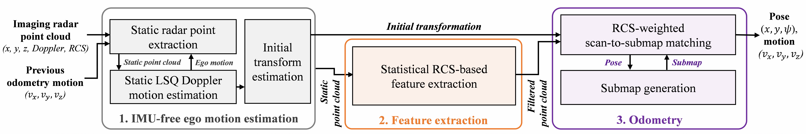
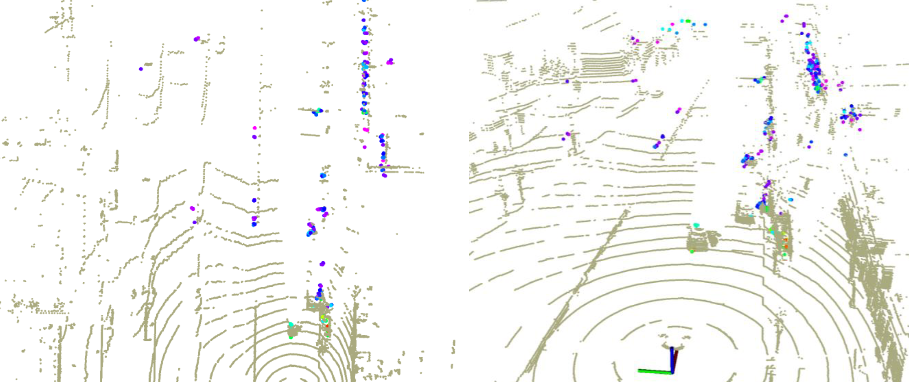
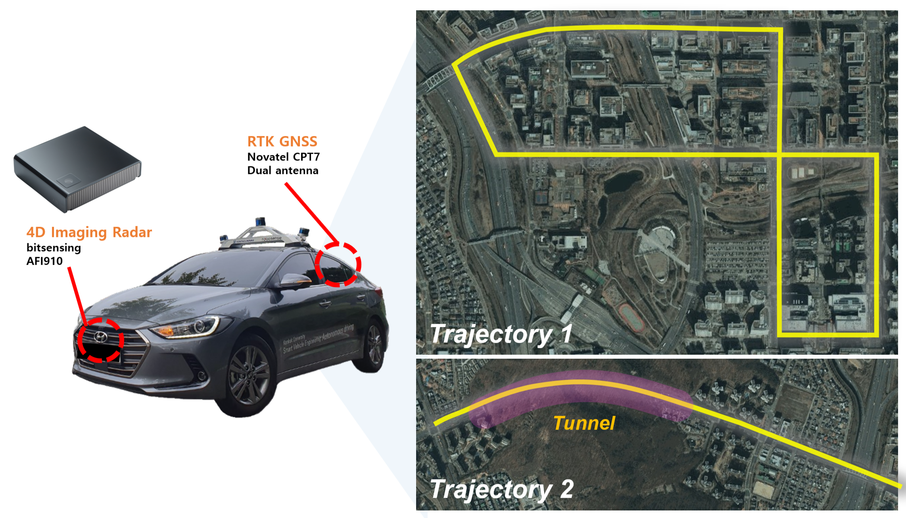

# Radar4Motion: 4D Imaging Radar IMU-free Odometry with RCS-weighted Correspondences
Codes for paper "*Radar4Motion: 4D Imaging Radar IMU-free Odometry with RCS-weighted Correspondences*"

Radar4Motion is a robust odometry method that utilizes Doppler and RCS information from the 4D imaging radar's point cloud, even in the presence of noisy and sparse point cloud data.

The code and dataset (ROS bag files) will be uploaded after the review process!

 
<b>System architecture</b>

 

## Demo

 
<b>32ch LiDAR (beige) vs. 4D Imaging Radar (rainbow)</b>

 
<b>Trajectory 1 (Urban)</b>

 
<b>Trajectory 2 (Tunnel)</b>

- The above `gif` shows **ONLY** odometry-based mapping results.
    - *NO inertial sensor, NO GNSS sensor, NO loop-closure*
    - **Only Single front-view 4D Imaging Radar!**
        - *yellow* : feature point cloud
        - *red* : submap point cloud
        - *rainbow* : raw radar point cloud
        - *white* : 32ch-LiDAR point cloud

## Dataset

 
<b>Data acquistion platform & area</b>

- Format
    - rosbag (*.bag*)
- Data acquired from ***Bundang-gu, Seongnam-si in South Korea***
    - Sensor
        - Bitsensing AFI910, RTK-GNSS(Novatel CPT7), Velodyne 32ch LiDAR, Camera
    - **Available Topics**
        - 4D Imaging Radar: `/afi910_cloud_node/cloud`
        - RTK-GNSS: `/novatel/oem7/inspvax`
        - IMU: `/novatel/oem7/corrimu`
        - 32ch LiDAR: `/velodyne_points`
        - Camera: `/a2A1920/image_raw/compressed`

## Contact

If you have any questions, please let me know:
- Soyeong Kim (`kimchuorok@gmail.com`)

## Acknowledgement

In the development of this package, we refer to [KISS-ICP](https://github.com/PRBonn/kiss-icp) and [REVE](https://github.com/christopherdoer/reve) for source codes.\
We utilized a [evo](https://github.com/MichaelGrupp/evo) package for odometry evaluation.
